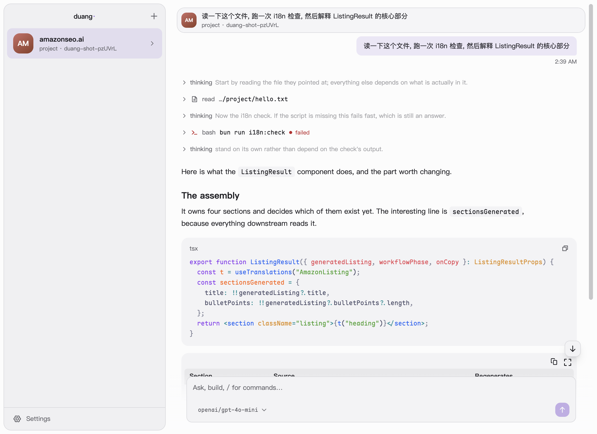

# duang

[](https://github.com/fastagent-sh/duang/actions/workflows/ci.yml)
[](https://github.com/fastagent-sh/duang/actions/workflows/codeql.yml)
[](LICENSE)
[](https://github.com/fastagent-sh/fastagent)
-555.svg)

**A native, local-first workbench for [FastAgent](https://github.com/fastagent-sh/fastagent) agents.**

Give an agent work, follow a long run while you do something else, come back to what actually
happened, and continue. Your agents sit in a sidebar like contacts; each conversation is a
FastAgent session, read from the agent's own runtime rather than copied into a second store.

<p align="center">
  
</p>

> **Status: early.** duang runs agents on your Mac only (Apple silicon), and there is no signed release
> yet: you build the app from source. Online agents, giving someone an agent and hosting are
> [planned](#roadmap), not built.

## Why

Making an agent in a terminal is easy now. Living with one is not: a long run scrolls past, switching
to something else loses track of it, and coming back means reading a log to find out whether it
worked. duang is the place you give an agent work and come back to the result. FastAgent supplies the
runtime; duang adds no transcript, database or agent format of its own.

## What it does

**Agents as contacts.** Each agent row quotes the newest output of its conversation, says `working`
while a run is going, and counts results you have not looked at yet (also on the Dock icon). Its
avatar's face shows what kind of work it is doing. Clicking an agent returns to the conversation you
left it on.

**Conversations that survive leaving.** Runs keep going when you switch agents or conversations.
Coming back finds the line you were reading; after a restart, the window reopens the same agent and
conversation with your unsent draft. History is read from FastAgent, so a run driven from elsewhere shows up too. Long
conversations open at their latest turn at once and fill in above it.

**A transcript you can read.** Answers render as Markdown with highlighted code. Tool calls and
thinking fold into one line per stretch of work (`thought 4s, read 2 files, ran 3 commands`) that opens for the
details. The live end of a run is said once: the step running, a retry being waited out
(`retrying 2/3`), or a model that has gone quiet (`no output for 45s`).

**Steer, stop, retry.** Type while a run is going to steer it; Esc stops it. A run that failed after
taking your message offers Retry, which first asks when the run had already used tools, because the
agent may repeat that work. Nothing is ever resent on its own.

**Models and effort per conversation.** The picker lists what the open agent can run: pi's built-in
models, the agent's `fastagent/models.json` and `~/.fastagent/models.json`, for providers you have
connected. Each conversation keeps its own model and reasoning effort; the agent's default only
applies to conversations that never chose. A refresh button fetches models released since your pi.

**Providers connected in the app.** Sign in with a subscription (Claude Pro/Max, ChatGPT, GitHub
Copilot and the other flows FastAgent supports) in the system browser, or paste an API key, which is
checked once with the provider before it is saved. The header shows how full the conversation's
context is and, for a Claude subscription, the plan's usage windows.

**Problems that say what to do.** A failure keeps the provider's original words and adds what they
mean and the way on: **Sign in again** for a rejected login, **Use another model** for an overloaded
provider, **Network settings** for a connection error, **Locate folder…** for an agent that moved,
**Start a fresh config** for one whose config no longer loads (the old file is kept beside it).

**Works behind a proxy.** Every model and sign-in request follows the system proxy as it is at that
moment, including PAC rules and a VPN switched on later; Settings → Network can fix a proxy or turn
it off, and checks the route. The agent's own commands (`git`, `npm`) get the proxy too.

Also: `/` completes the agent's skills, extension commands and prompt templates; light and dark
follow the system; seven avatar styles; the sidebar and transcript work from the keyboard.

## Install

Requirements: macOS on Apple silicon, Node 24 and npm.

```bash
git clone https://github.com/fastagent-sh/duang.git
cd duang
npm ci
npm run package     # builds dist/duang-<version>-arm64.dmg
```

Open the dmg and drag duang to Applications. The app is not signed with an Apple Developer ID yet, so
macOS refuses the first open: right-click duang → **Open**, or System Settings → Privacy & Security →
**Open Anyway**. To update, pull, run `npm run package` again and replace the app.

## Getting started

1. **Add an agent.** Click **+** at the top of the sidebar and choose a FastAgent agent directory, or a plain project: duang
   offers to create `fastagent/fastagent.config.ts` and a `.gitignore` there, after asking, and never
   overwrites an existing `fastagent/` directory.
2. **Connect a provider.** Settings (`⌘,`) → Model providers, or **Connect a provider** in the model
   picker.
3. **Pick a model and send.** A new agent has no default model, so its first conversation asks for
   one. `⌘N` starts a new conversation.

## How it works

```text
renderer (React) ── typed preload API ── Electron main ── FastAgent, in-process
```

- **Main owns the runtime.** Each agent is assembled with FastAgent's public
  `createPiAgentFromDir`, inside Electron main, without opening a local port. The renderer runs with
  context isolation and no Node access; it gets named operations, never the filesystem, a shell or
  credentials.
- **No second transcript.** Conversations live in each agent's FastAgent state. duang reads history
  and live events from the runtime; it stores only presentation state (drafts, the open
  conversation, where you were reading).
- **duang's own files** live in its data directory, `~/Library/Application Support/duang/`:
  `agents.json` (the agents you added), `settings.json` (network and avatar style) and `auth.json`
  (provider credentials). Writes are atomic, and a file that cannot be read is reported with its
  original error, never treated as empty or overwritten.
- **One credential file.** duang reads only its own `auth.json`, not the `fastagent` CLI's, pi's or a
  project's: one OAuth login kept in two files is invalidated by whichever refreshes first. A login
  made in a terminal is made again in duang. Provider environment variables still apply.
- **One instance.** Only one duang runs per data directory; starting another brings the running one
  forward. The installed app and `npm run dev` share the directory.

More: [architecture](docs/architecture.md) (processes, state ownership, network route),
[interaction](docs/interaction.md) (behavior and failure handling), [design](docs/design.md)
(surfaces and flows) and [UI](docs/ui.md) (the visual system).

## Known limitations

- macOS on Apple silicon only, and unsigned.
- An agent is added from a directory: today a `fastagent/` directory inside a project, which works on
  the project around it. Creating agents with the folders they work on waits for FastAgent's
  agent-directory release ([#133](https://github.com/fastagent-sh/duang/issues/133)).
- Removing an agent removes it from duang only; its directory and conversations stay on disk.
- Credentials are a plain JSON file (mode `0600`), as FastAgent writes it, not the macOS Keychain
  ([fastagent#652](https://github.com/fastagent-sh/fastagent/issues/652)).
- A proxy that needs a user name and password is not supported.
- History read back has no durations (how long a call or a thought took), and output streamed before
  a reload that never became an entry is not replayed.
- Token counts and cost are not shown. A Claude subscription's usage comes from an endpoint
  Anthropic does not document; Sign in with ChatGPT links to its usage page instead.
- A command name typed by hand that the agent does not know goes to the model as plain text.
- Attachments and voice input are not implemented.
- duang does not run an agent's routines or channels, and has no online agents or sharing yet.

## Roadmap

Each stage is an outcome that has to be shown working with real use, not a date
([how that is measured](docs/design.md#how-we-know-it-worked)). The first local
milestone ([Week 1](https://github.com/fastagent-sh/duang/milestone/1)) is accepted; stage 1 is in
progress; the rest are planned.

1. **Daily local workbench.** Create an agent with the folders it works on and the ones it should
   know, use it every day without a terminal, and inspect what it loaded and changed.
2. **Give someone the Agent.** They get their own copy, connect their own credentials and keep their
   own conversations. No secrets, runtime state or machine-only paths travel with it.
3. **Online contacts.** Connect your own protected, already-running agent, including one that runs
   routines while your laptop is closed; then invite someone else to it, each visitor seeing only
   their own conversations, revocably.
4. **Optional hosting.** Publish, update and stop an agent without operating a server, with
   scheduled routines that actually run while the laptop is off.
5. **Groups and discovery,** only if existing chat channels and direct invitations prove not enough.

The words follow FastAgent's agent model ([fastagent#684](https://github.com/fastagent-sh/fastagent/issues/684)):
an **Agent** is a definition in a directory of its own, a **context** is a folder it works on or
knows, an **instance** is one Agent running in one place, and a **conversation** is a FastAgent
session of one instance. [Design](docs/design.md) describes each stage's flows.

## Development

```bash
npm run dev           # Electron + Vite; main and preload edits restart the app
npm test              # unit tests
npm run build         # type check and build
npm run test:smoke    # the real app with a fake model: the local workflow, then the live transcript
npm run shots         # screenshots of the real window in both colour modes, into out/shots/
npm run test:package  # package, then run the installed app outside the checkout
npm run test:perf     # timings on a 150-turn conversation (machine-dependent, not in CI)
DUANG_LIVE=1 npm run test:live  # opt-in: real provider calls with this machine's duang logins
```

FastAgent is pinned to an exact published version. Automated tests use isolated data and fake model
endpoints; only `test:live` talks to real providers, spends model credits, and must run while duang
is closed.

## Contributing

Issues, discussions and pull requests are welcome. Read [CONTRIBUTING.md](CONTRIBUTING.md) for setup,
the branch and PR workflow and what to verify. Questions and ideas go to
[Discussions](https://github.com/fastagent-sh/duang/discussions). Report a vulnerability privately as
described in [SECURITY.md](SECURITY.md), never in a public issue.

## License

[MIT](LICENSE). Bundled fonts are under the SIL Open Font License (`src/renderer/fonts/OFL-*.txt`);
provider logos are LobeHub's, under their license (`src/renderer/provider-logos/LICENSE`); avatar
styles are DiceBear's (CC0, except Bottts, free for personal and commercial use).
